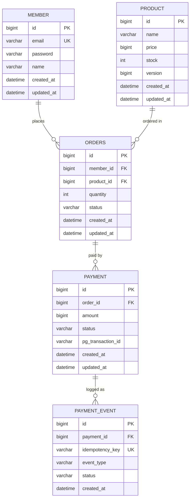

# PayFlow

## ERD

```mermaid
erDiagram
    MEMBER {
        bigint id PK
        varchar email UK
        varchar password
        varchar name
        datetime created_at
        datetime updated_at
    }

    PRODUCT {
        bigint id PK
        varchar name
        bigint price
        int stock
        bigint version
        datetime created_at
        datetime updated_at
    }

    ORDERS {
        bigint id PK
        bigint member_id FK
        bigint product_id FK
        int quantity
        varchar status
        datetime created_at
        datetime updated_at
    }

    PAYMENT {
        bigint id PK
        bigint order_id FK
        bigint amount
        varchar status
        varchar pg_transaction_id
        datetime created_at
        datetime updated_at
    }

    PAYMENT_EVENT {
        bigint id PK
        bigint payment_id FK
        varchar idempotency_key UK
        varchar event_type
        varchar status
        datetime created_at
    }

    MEMBER ||--o{ ORDERS : "places"
    PRODUCT ||--o{ ORDERS : "ordered in"
    ORDERS ||--o{ PAYMENT : "paid by"
    PAYMENT ||--o{ PAYMENT_EVENT : "logged as"
```
