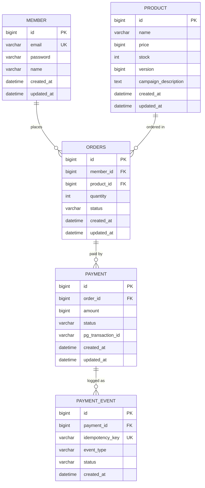

# PayFlow

## 프로젝트 배경

카드사는 제휴 가맹점과 함께 한정수량 특가 캠페인을 정기적으로 운영한다.
캠페인 오픈 순간 수천 명의 동시 결제 요청이 몰리는 상황에서
재고 초과 판매, 중복 결제, PG사 장애 등의 문제가 발생할 수 있다.
PayFlow는 이 시나리오를 기반으로 설계된 고신뢰 결제 처리 시스템이다.

## 핵심 기술 선택 배경 (시나리오 연결)

- **선착순 한정수량 → 동시 재고 차감 경쟁** → Redis Lua Script (원자적 처리)
- **네트워크 순단/사용자 재시도 → 중복 결제 위험** → DB UNIQUE 멱등성 키
- **캠페인 피크 트래픽 → PG사(토스페이먼츠) 간헐적 장애** → Circuit Breaker + Retry + Fallback
- **보상 트랜잭션 실패 감사** → REQUIRES_NEW 독립 트랜잭션으로 보상 로그 영구 보존

## ERD

