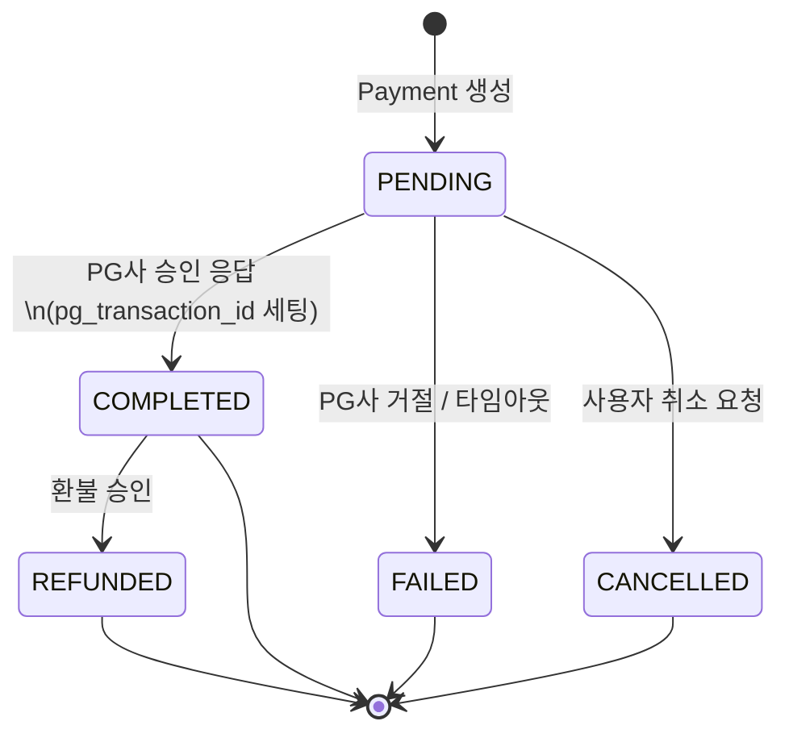
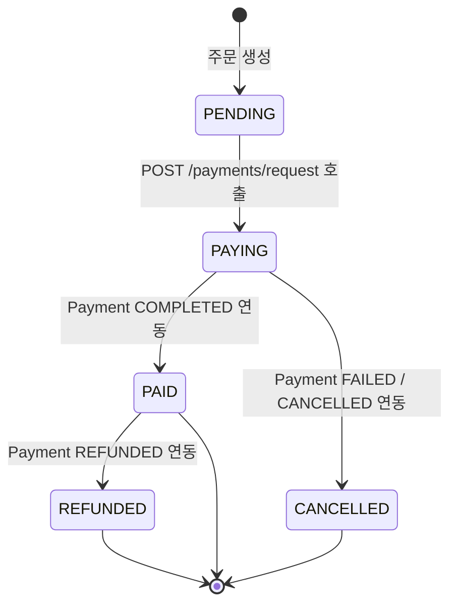
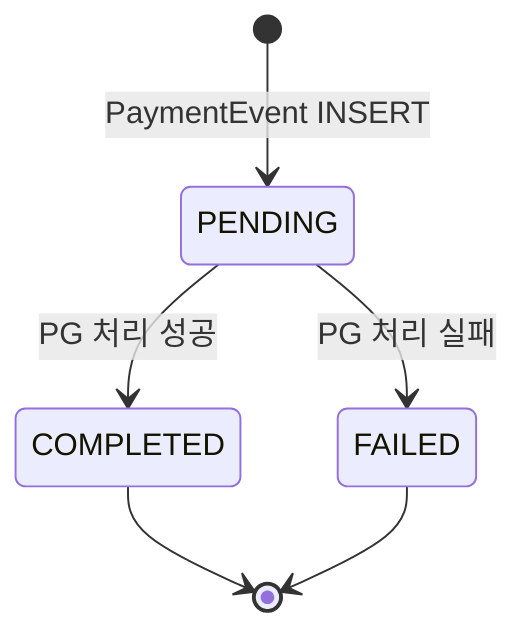

# 결제 & 주문 상태 머신

결제는 단순한 성공/실패가 아닌 상태 전이의 연속이다.
Payment, Order, PaymentEvent 세 엔티티가 각각 독립적인 상태를 가지며,
결제 이벤트 발생 시 함께 전이된다.

---

## 상태 정의

### Payment

| 상태 | 설명 | 진입 조건 |
|---|---|---|
| PENDING | Payment 레코드 생성 시 초기 상태 | Payment 생성 시 자동 설정 |
| COMPLETED | PG사 승인 응답 수신 완료 | PG사 승인 응답 + pg_transaction_id 세팅 |
| FAILED | PG사 거절 또는 타임아웃 | PG사 실패 응답 또는 응답 없음 |
| CANCELLED | 결제 완료 전 사용자 취소 | PENDING 상태에서 취소 요청 |
| REFUNDED | 결제 완료 후 환불 승인 | COMPLETED 상태에서 환불 요청 |

### Order

| 상태 | 설명 | 진입 조건 |
|---|---|---|
| PENDING | 주문 최초 생성 시 초기 상태 | 주문 생성 시 자동 설정 |
| PAYING | 결제 진행 중 상태 | `POST /payments/request` 호출 시 — PG사 결제창 진입 전 |
| PAID | 결제 성공 확정 상태 | Payment COMPLETED 연동 |
| CANCELLED | 결제 실패 또는 취소 | Payment FAILED / CANCELLED 연동 |
| REFUNDED | 환불 처리 완료 | Payment REFUNDED 연동 |

> **PAYING 진입 시점:** PG사 결제창이 열리는 시점이 아닌, `POST /payments/request` API
> 호출 시점에 Order가 PAYING으로 전이된다. 이 시점에 Payment 레코드와 PaymentEvent가
> 함께 생성되며, 사용자가 결제창을 닫거나 응답이 없는 경우에도 PAYING 상태가 남아
> 미완료 결제 감지가 가능하다.

### PaymentEvent

| 상태 | 설명 |
|---|---|
| PENDING | PaymentEvent INSERT 시 초기 상태. PG 처리 대기 중 |
| COMPLETED | PG 처리 성공 |
| FAILED | PG 처리 실패. 재시도 여부는 서비스 레이어에서 판단 |

---

## 상태 전이 다이어그램

### Payment



### Order



### PaymentEvent



---

## Payment ↔ Order 연동 흐름

### 결제 요청

```
POST /payments/request
  → Order: PENDING → PAYING
  → Payment 생성 (PENDING)
  → PaymentEvent 생성 (CONFIRM / PENDING) — idempotencyKey: "{orderId}:CONFIRM"
  → PG사 호출

  [성공]
    → PaymentEvent: PENDING → COMPLETED
    → Payment: PENDING → COMPLETED  (pg_transaction_id 세팅)
    → Order: PAYING → PAID
    → Product.decreaseStock(quantity)  ← 낙관적 락(@Version) 적용

  [실패 / 타임아웃]
    → PaymentEvent: PENDING → FAILED
    → Payment: PENDING → FAILED
    → Order: PAYING → CANCELLED
    (재고 변화 없음)
```

### 취소 요청 (결제 완료 전)

> 진입 조건: Payment 상태가 **PENDING** 일 때만 가능

```
DELETE /payments/{paymentId}
  → PaymentEvent 생성 (CANCEL / PENDING) — idempotencyKey: "{orderId}:CANCEL"
  → PG사 취소 호출
  → PaymentEvent: PENDING → COMPLETED
  → Payment: PENDING → CANCELLED
  → Order: PAYING → CANCELLED
  (재고 복구 없음 — 차감이 발생하지 않은 시점이므로)
```

### 환불 요청 (결제 완료 후)

> 진입 조건: Payment 상태가 **COMPLETED** 일 때만 가능

```
POST /payments/{paymentId}/refund
  → PaymentEvent 생성 (REFUND / PENDING) — idempotencyKey: "{orderId}:REFUND"
  → PG사 환불 호출
  → PaymentEvent: PENDING → COMPLETED
  → Payment: COMPLETED → REFUNDED
  → Order: PAID → REFUNDED
  → Product.increaseStock(quantity)  ← 재고 복구
```

---

## 재고(Stock) 처리 시점

| 이벤트 | 재고 변화 | 비고 |
|---|---|---|
| Payment COMPLETED | `decreaseStock(quantity)` | `@Version` 낙관적 락으로 동시성 제어 |
| Payment REFUNDED | `increaseStock(quantity)` | 환불 완료 후 복구 |
| Payment FAILED | 변화 없음 | 차감 전 실패이므로 복구 불필요 |
| Payment CANCELLED | 변화 없음 | 차감 전 취소이므로 복구 불필요 |

---

## 엣지 케이스 & 예외 처리

| # | 케이스 | 처리 방식 |
|---|---|---|
| 1 | 이미 CANCELLED인 Payment에 취소 요청이 다시 오면? | `idempotency_key` UNIQUE 제약으로 중복 INSERT 차단. 이미 처리된 요청으로 간주해 성공 응답 반환 |
| 2 | COMPLETED 상태의 Payment에 CANCEL 요청이 오면? | 불가. `COMPLETED → CANCELLED` 전이는 정의되지 않음. REFUND 요청으로만 처리 가능 |
| 3 | REFUNDED 상태의 Payment에 재환불 요청이 오면? | 불가. REFUNDED는 종료 상태. 예외 발생 |
| 4 | PAYING 중 PG사 타임아웃 → Payment FAILED → Order는? | Order CANCELLED로 전이. 재고는 차감된 적 없으므로 복구 불필요 |
| 5 | Payment FAILED 후 사용자가 재결제를 원하면? | 새 Payment 레코드 생성. 기존 FAILED Payment는 이력으로 보존 (불변 이력 취급) |

---

## 멱등성 키 패턴

```
idempotencyKey = "{orderId}:{eventType}"
```

| 예시 | 키 |
|---|---|
| 주문 42, 결제 승인 | `42:CONFIRM` |
| 주문 42, 취소 | `42:CANCEL` |
| 주문 42, 환불 | `42:REFUND` |

- eventType이 다르면 같은 orderId라도 키가 달라지므로 CONFIRM과 REFUND는 독립적으로 처리된다.
- `payment_event` 테이블의 `idempotency_key UNIQUE 제약`이 중복 처리를 원천 차단한다.
